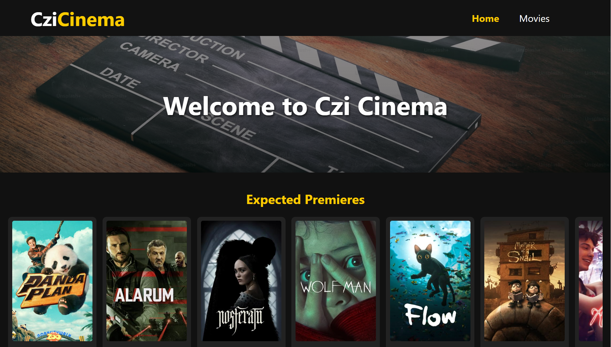

# My Portfolio

Portfolio: [czinaaz.portfolio](https://czinaaz.github.io/website-portfolio/)

## Description

Welcome to my portfolio! This repository contains a collection of my projects, showcasing my skills and expertise in various areas of software development and design.

## Screenshots

Here are some screenshots of my portfolio:

## Installation

There's no need for installation as this is a static website. Simply clone the repository to your local machine and open the `index.html` file in your web browser.

## Usage

Feel free to explore the projects listed in the portfolio. Each project comes with a brief description and links to view the live demo and source code.

## Contributions

If you'd like to contribute to my portfolio or have suggestions for improvements, please feel free to open an issue or submit a pull request.

## Author

Ivan Rudenko

Contact: rudenko.ivan81@gmail.com

